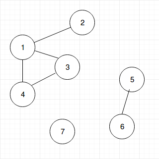

# Unsupervised Learning
This repository contains various unsupervised learning algorithms.

# Setting up the environment
To set up your virtual environment, use the command "./setup.sh".

# Running the program
To run the program, simply use python main.py. Remember that you have to set up 
the environment first, or it will probably throw an error.

# Algorithms
## KNN clustering
This algorithm computes the K-nearest neighbors for every point in the dataset. It is 
a soft clustering algorithm since it is possible that the clusters it generates 
share points, which means the clusters are not disjoint.
This function has a hyperparameter "K", which you can tweak in the parameters.json
file. 
## Connected Components clustering
This clustering algorithm was inspired by the connected components problem in
graphs. This problem consists on finding the connected components in a graph like
the following. 

For this algorithm, we define that two points are connected if their distance is 
less or equal to DISTANCE_THRESHOLD (which is a hyperparameter). This, ofcourse,
is a hard clustering algorithm, since a point cannot belong to two clusters at the same
time. 

TIP: The bigger the threshold, the fewer the clusters.
## Distance Based clustering
This soft clustering algorithm uses the hyperparameters "N_CLUSTERS". What the algorithm
does is find N clusters for each point in the dataset based on a distance matrix.
## Mountain clustering
## Subtractive clustering
## K-Means clustering
## Fuzzy c-Means clustering

